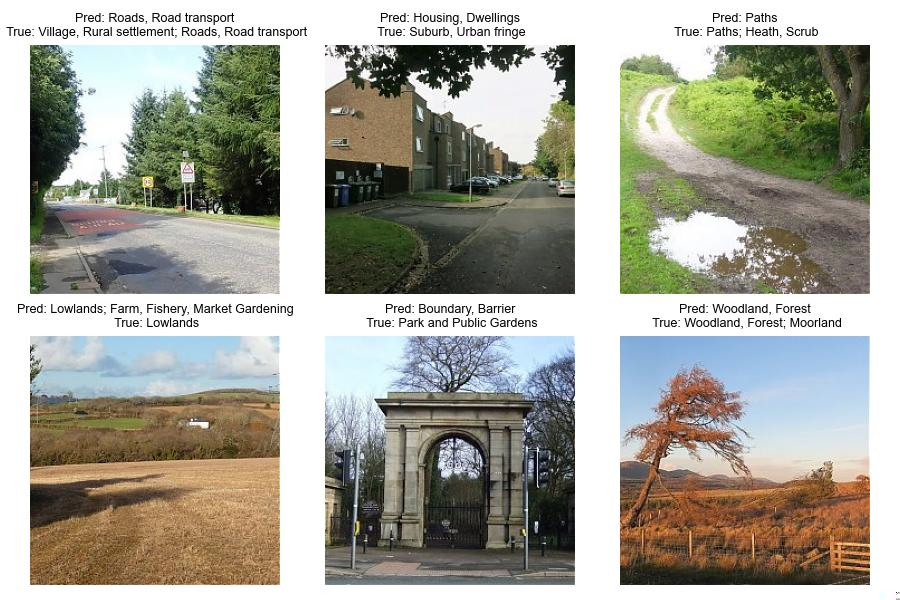

# CLIP the Landscape: Automated Tagging of Crowdsourced Landscape Images

[](TODO)
[](https://www.kaggle.com/competitions/predict-geographic-context-from-landscape-photos/)


This repo contains our CLIP-based, multi-modal classifiers for the Kaggle 'Predict Geographic Context from Landscape Photographs' [challenge](https://www.kaggle.com/competitions/predict-geographic-context-from-landscape-photos/) on the Geograph dataset. It provides scripts to:

* Download and preprocess training and test sets
* Train MLP and linear classifiers on CLIP image, title and location embeddings (alone or in combination)
* Evaluate model performance and generate Kaggle-ready submission files (.csv.zip)

📃 Our pre-print is available on arXiv [TODO link].

✍️ Authors: [Ilya Ilyankou](https://ilyankou.com)\*, [Natchapon Jongwiriyanurak](https://profiles.ucl.ac.uk/79254-natchapon-jongwiriyanurak)\*, Tao Cheng, and James Haworth

*Equal contribution

## Setup

We suggest running the notebooks in a separate virtual environment. Using [`miniconda`](https://www.anaconda.com/docs/getting-started/miniconda/main),

```shell
# Navigate to the project folder
cd ClipTheLandscape

# Create a new virtual environment
conda env create -f environment.yml

# Activate that new virtual environment
conda activate clip-the-landscape

# Run Jupyter (will open in your default browser) or use VSCode instead
jupyter lab
```

## Examples of misclassified images

This section illustrates the subjectivity of labelling; our model's predicted tags are often as (or even more) appropriate as the original annotations. Tags like *Canals*, *Air transport*, *Railways*, and *Burial ground*, which represent distinct and objective features, achieve high $F_1$ scores; less visually pronounced tags like *Flat landscapes* and *Lowlands* perform poorly.



# Cite

TODO